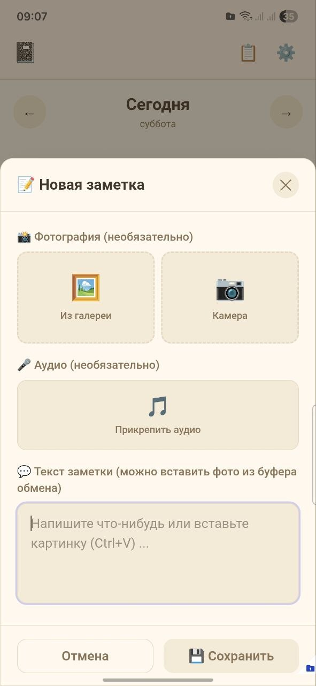
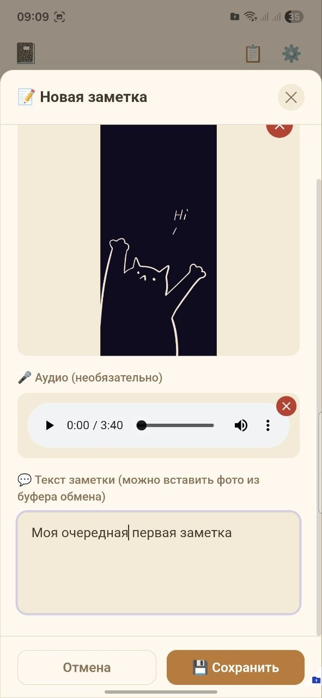
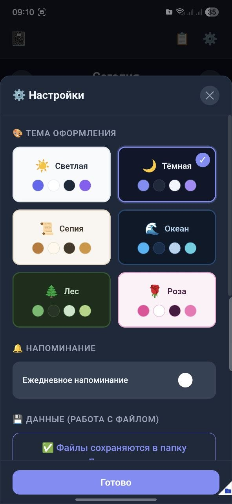
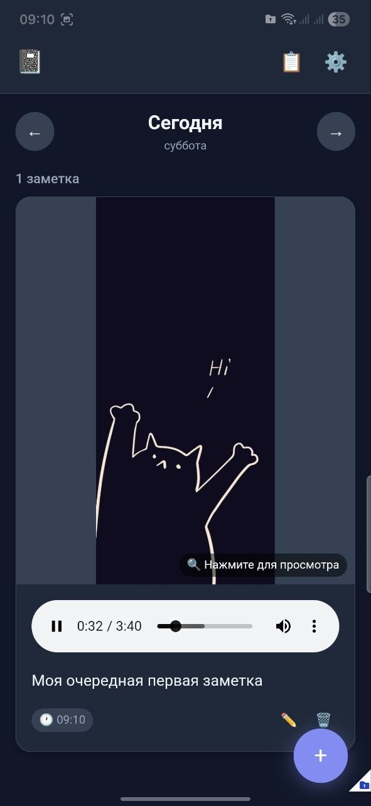
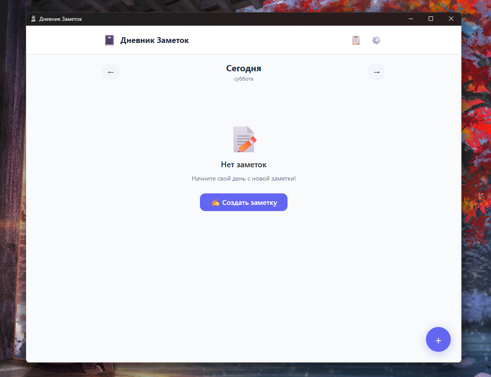
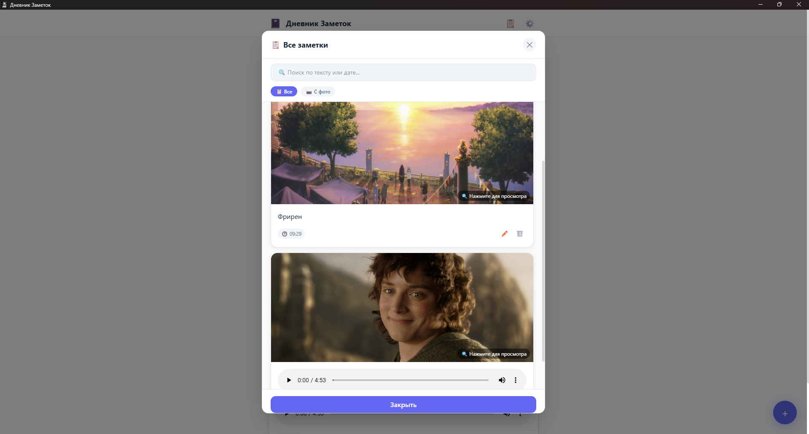

# 📓 Дневник Заметок

[Онлайн версия Дневника Заметок](https://rintaru123.github.io/DiaryNotes/)

Универсальное и кроссплатформенное приложение для ведения ежедневных заметок с фотографиями и аудио. Программа может работать автономно как приложение на ПК, как мобильное приложение на Android, а также в браузере. 

**Идея проекта, дизайн и улучшения:** [Rintaru123](https://github.com/rintaru123)  
**Разработка:** AI Assistant

---

## 🌟 Основные возможности

- **Медиафайлы**: Прикрепление к заметкам фотографий (с камеры или из галереи) и аудиофайлов (диктофон или готовые файлы). Поддержка вставки изображений из буфера обмена (Ctrl+V).
- **Умное хранение**:
  - **На ПК (Electron)**: Все фотографии и аудиофайлы автоматически сохраняются в виде обычных файлов в папки `images` и `audio` рядом с `notes_data.json`. Это позволяет держать саму базу легкой и быстрой.
  - **На Android (Capacitor)**: Приложение незаметно сохраняет базу в системную папку Документов телефона, а медиафайлы — как отдельные файлы, чтобы не засорять кэш телефона.
  - **В браузере (Web)**: Работа с одним единственным файлом `.json` через File System API, что позволяет хранить файл с заметками, например, на флешке.
- **Темы оформления**: 6 красивых тем оформления (Светлая, Темная, Сепия, Океан, Лес, Роза) с полной поддержкой стилей.
- **Ежедневные Напоминания**: Умная система напоминаний — программа пришлет уведомление (Push) в заданное время, **только если** вы сегодня еще не писали ни одной заметки.
- **Резервное копирование**: Поддержка экспорта и импорта базы в форматах `JSON` и `ZIP`. В `ZIP`-архив автоматически вкладываются все ваши фотографии и песни для легкого переноса между устройствами.

## 🚀 Как запустить или собрать проект

### 1. Десктопная версия (Electron)

Проект настроен на сборку **двух** вариантов десктопного приложения:
1. **Portable (Портативная версия)**: Программа распаковывается и запускается прямо из папки (идеально для флешки). Все настройки и папки с фото/аудио создаются рядом с файлом `notes_data.json` в папке программы.
2. **Установщик**: Установочный `.exe` файл с максимальным сжатием. Весит значительно меньше и устанавливается на компьютер.

```bash
npm install
npm run electron:build
```
*После сборки в папке `dist-electron` появятся оба варианта (Установщик и Portable).*

### 2. Версия для Android (.apk)

Проект использует Capacitor для работы с нативными функциями устройства (уведомления, файловая система). Приложение не перекрывает системный Status Bar сверху, так что вы будете видеть время и заряд батареи. Вы можете выбрать пользовательскую папку для хранения базы в настройках приложения.

**Как установить свою иконку:**
1. Поместите файл `icon.png` (размер 1024x1024) в папку `resources/` в корне проекта (создайте папку, если её нет).
2. Запустите команду `npm run generate-icons` — она автоматически сгенерирует все нужные размеры иконок для Android-приложения.

```bash
npm install
npm run build
npm run cap:add:android
npm run generate-icons
npm run cap:sync
npm run cap:open
```
*В открывшейся Android Studio нажмите `Build -> Build Bundle(s) / APK(s) -> Build APK(s)`.*

### 3. Чистая веб-версия (Single HTML)

Вся программа компилируется в один-единственный файл `dist/index.html`. 
Вы можете просто открыть его в любом браузере, и он предложит вам выбрать или создать на диске файл для базы данных.
```bash
npm install
npm run build
```

## 🛠 Технологии и Лицензии
Проект написан на **React + TypeScript + Vite**. Стилизация: **Tailwind CSS**.
В приложении используется набор иконок [Lucide React](https://lucide.dev/) (ISC License).

Проект распространяется по лицензии [MIT](LICENSE).

---

## 💬 Поддержка

Если вы нашли баг или у вас есть предложение по улучшению:
- 🐛 [Создайте Issue](https://github.com/rintaru123/diary-notes/issues)
- 💡 [Обсудите идею](https://github.com/rintaru123/diary-notes/discussions)

**Сделано с ❤️ командой разработки Дневник Заметок**

## Скриншоты

### На смартфоне









### На компьютере




